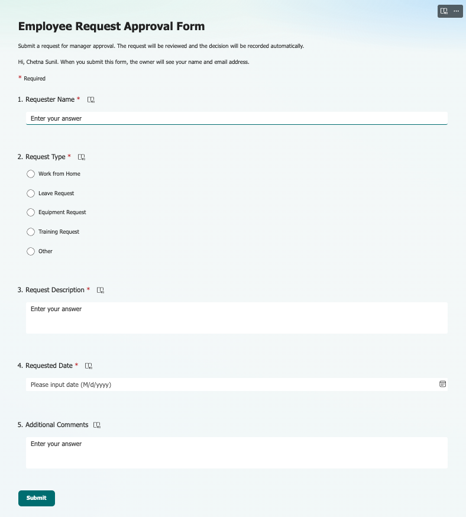
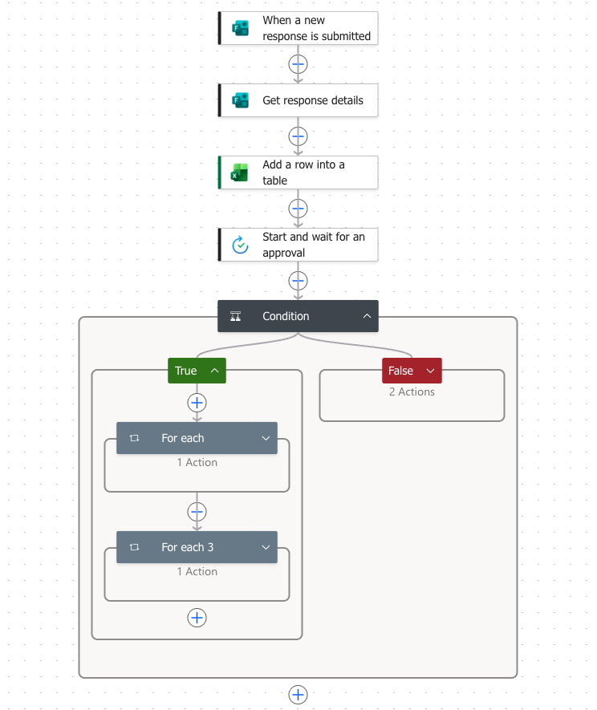
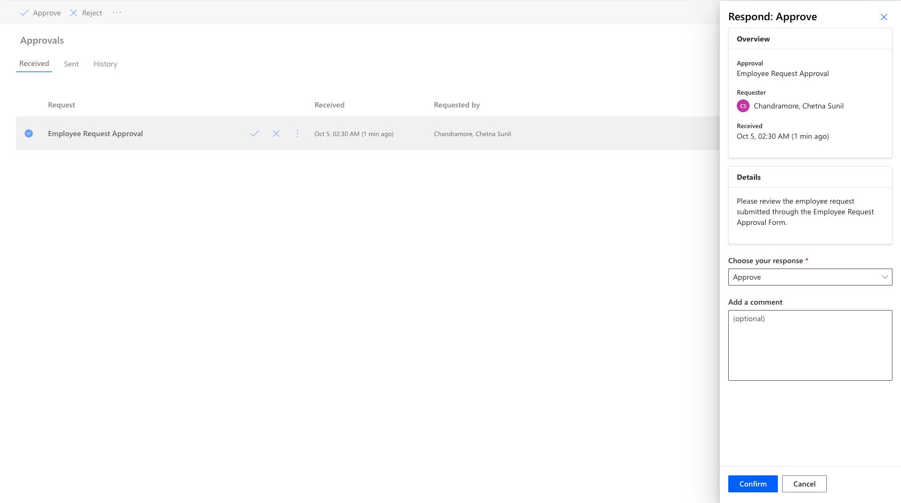
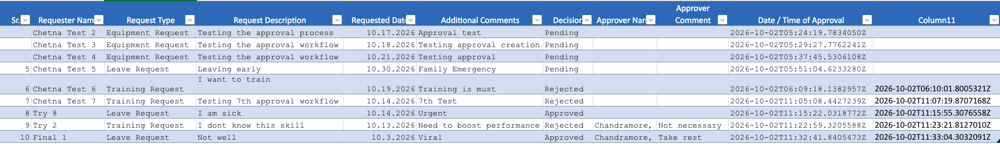
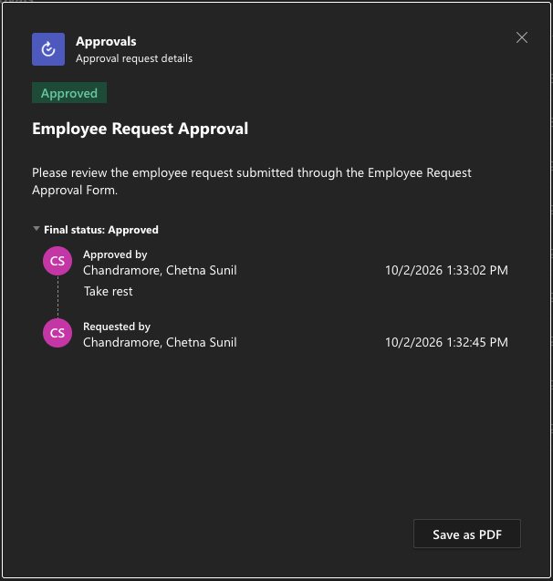

# Automated Approval Workflow

An end-to-end low-code approval workflow built with **Microsoft Power Automate, Microsoft Forms, Excel Online and Microsoft Teams**.

The project automates employee request submission, manager approval, audit logging and outcome notifications, replacing a manual approval-tracking process.

## Project Overview

The workflow allows an employee to submit a request through Microsoft Forms. Power Automate retrieves the request details, creates an approval request, processes the manager's decision and automatically updates a centralized Excel audit log.

A Teams notification is then sent based on the approval outcome.

## Workflow Architecture

```text
Microsoft Forms
      ↓
Power Automate
      ↓
Get Response Details
      ↓
Excel — Create Audit Record
      ↓
Manager Approval
      ↓
Approve / Reject Condition
      ↓
 ┌───────────────┴───────────────┐
 ↓                               ↓
Approved                       Rejected
 ↓                               ↓
Update Excel                   Update Excel
 ↓                               ↓
Teams Notification             Teams Notification
```

## Technologies Used

- **Microsoft Power Automate** — workflow automation and process orchestration
- **Microsoft Forms** — request data collection
- **Excel Online** — centralized approval audit log
- **Microsoft Teams** — automated approval outcome notifications
- **Power Platform Connectors** — integration between Microsoft 365 services

## Key Features

- Form-triggered workflow execution
- Automated approval creation
- Approve/Reject conditional routing
- Centralized Excel audit logging
- Automatic recording of:
  - Request ID
  - Requester
  - Request type
  - Requested date
  - Approval status
  - Approver
  - Approval comments
  - Submission timestamp
  - Decision timestamp
- Automated Teams notifications
- Dynamic content mapping between workflow steps
- Expressions for timestamps and workflow logic

## Example Workflow

1. Employee submits a request through Microsoft Forms.
2. Power Automate retrieves the submitted information.
3. The request is recorded in the Excel audit log with a **Pending** status.
4. An approval request is created.
5. The approval outcome is evaluated using a condition.
6. The Excel record is updated to **Approved** or **Rejected**.
7. Approver details, comments and decision timestamp are recorded.
8. A corresponding notification is sent through Microsoft Teams.

## Testing

The workflow was tested with both approval outcomes.

### Approved Request

- Approval Status: **Approved**
- Approver: Recorded
- Approval Comments: Recorded
- Decision Date: Recorded
- Teams notification: Successfully delivered

### Rejected Request

- Approval Status: **Rejected**
- Approver: Recorded
- Approval Comments: Recorded
- Decision Date: Recorded
- Teams notification: Successfully delivered

## Skills Demonstrated

- Workflow automation
- Microsoft Power Automate
- Microsoft Forms
- Microsoft Teams
- Excel Online
- Conditional logic
- Dynamic content
- Expressions
- Connector-based integration
- Process automation
- Audit logging
- Workflow testing and troubleshooting

## Project Status

**Completed**

## Screenshots

### Microsoft Forms


### Power Automate Workflow


### Approval Request


### Excel Audit Log


### Teams Notification

